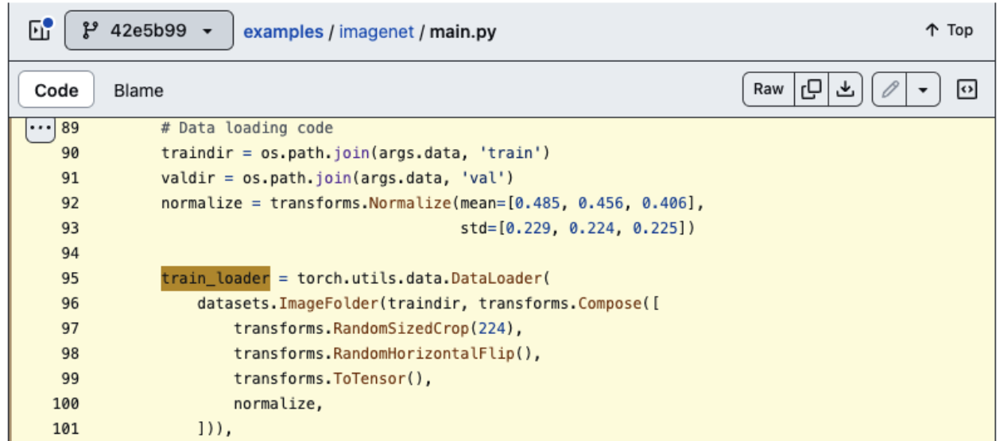
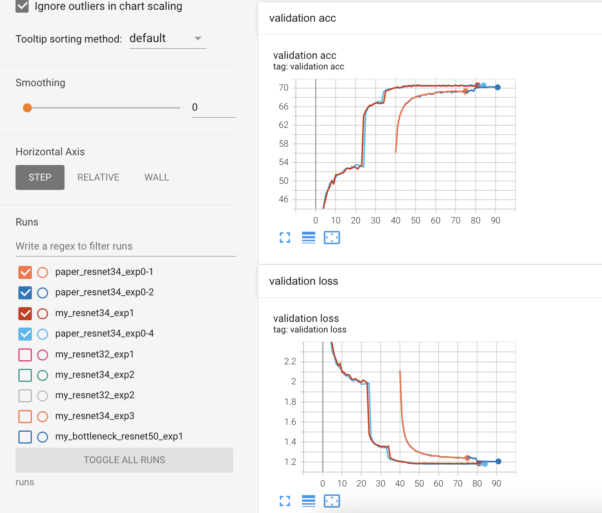
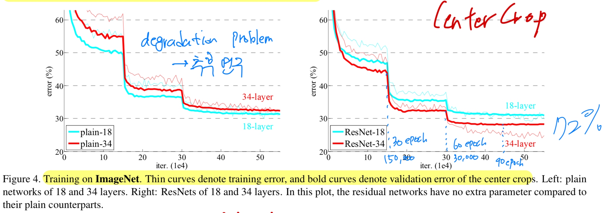

# ResNet34

0. `exp0`/
   * pytorch 첫 실습이었기 때문에 논문에서 detail한 부분은 우선 신경쓰지 않고,
pytorch에서 제공하는 model.resnet34()가 제대로 training되는지 확인하고자 함.
   * 또한 추후에 직접 구현할 resnet이 pytorch에서 구현한 resnet과 동일한 성능을 낼 수 있는지 test할 수도 있음.
   * 논문에서 learning rate를 plateau일 때, 10씩 divide했다고 하여 lr_scheduler를 다음과 같이 설정.
      ``` py
      lr_scheduler = lr_scheduler.ReduceLROnPlateau(optimizer, mode='min', factor=0.1, patience=5, verbose=True)
      ```
   1. `exp0-1` : 
      * training 시키다가, 40 epoch에서 val_loss, val_acc가 saturation되었는데도 lr decay가 되지 않음.<br>
      <span style="color:red">(나중에 깨달은 이유이지만, 이 이유는 lr_scheduler의 threshold arguement의 default값이 0.0001인데, 이는 매우 엄격한 lr_scheduler여서 lr decay가 되지 않았던 것.)</span>
      * 그래서 training을 중단하고, learning rate를 1e-01에서 1e-03로 바꾸어 다시 진행.<br>
      (learning rate가 1e-02은 매우 크다는 **주관적인 잘못된 생각으로 1e-03로 바꿈**.)
   2. `exp0-2` :
      * 역시나 80 epoch에서 val_loss, val_acc가 saturation되었는데도 lr decay가 되지 않음.<br>
      * 마찬가지로 training을 중단하고, learning rate를 1e-03에서 1e-04로 바꾸어 다시 진행.<br>
   3. `exp0-3` : 
      * exp0-2에서 training이 잘 되는 것 같다고 생각하여, 이제 논문에서의 val_acc와 똑같게 만들기 위해
      dataset preprocessing, hyper parameter를 수정함
      * 또한 lr decay가 제대로 동작할 수 있도록, lr_scehduler를 다음과 같이 수정. (patience=, threshold=)
         ``` py
         lr_scheduler = lr_scheduler.ReduceLROnPlateau(optimizer, mode='min', factor=0.1, patience=3, verbose=True, threshold=0.01)
         ```
   4. `exp0-4` : 
      * exp0-3에서 오히려 val_acc가 계속 낮아졌음. 
      (나중에 preprocessing할 때, 부적절한 RandomResizedCrop()을 사용했기 때문임을 알아냈음.)
      (하지만 당시에는 preprocessing에 문제를 알아내지 못하여, pytorch resnet sample code에서 사용했던 preprocessing 방법을 그대로 사용해봄.)
      
      * exp0-1 ~ exp0-3 중에서는 가장 좋은 성능(73.016%)을 보였지만, 여전히 논문의 val_acc(75.28%)과 동일한 수치가 나오지는 못했다.
   > 이외에도 여러 실험들을 해봤지만 논문의 10-crop val_acc인 75.28%에 도달하지 못하여 architecture(basic residual block)의 문제인지 의심이 되었음.<br>
   그래서 dataset이 훨씬 작은 [../ResNet32 on CIFAR-10](https://github.com/LeeHyungSeop/EAI_Basic_PyTorch/tree/main/02_ResNet/ResNet32)에 대해서 architecture 문제인지 아닌지 판단하려고 함.<br><br>
   <span style="color:red">[../ResNet32 on CIFAR-10](https://github.com/LeeHyungSeop/EAI_Basic_PyTorch/tree/main/02_ResNet/ResNet32)에서 동일한 basic block으로 구성한 ResNet32()가 논문과 동일한 성능을 도달했으므로 architecture 문제는 아니라고 판단.</span><br>
   
---
1. `exp1/`
   * [../ResNet32 on CIFAR-10](https://github.com/LeeHyungSeop/EAI_Basic_PyTorch/tree/main/02_ResNet/ResNet32)을 통해서 architecture 문제는 아니라고 판단되었고, <br>
     exp0-1 ~ exp0-4 중에서 exp0-4가 가장 좋은 성능을 보였으니, <br>
     exp0-4와 preprocessing, hyper parameter를 모두 동일하게 설정하고,<br>
     **단, torch의 model.resnet34()가 아닌 직접 구현한 resnet34()로 training 진행.**
   * 당연히 exp1/은 exp0-4와는 직접 구현한 resnet34()를 사용한 것 빼고는 모두 같은 조건에서 training했으므로 동일한 graph가 그려짐.
   

---
2. `exp2/`
   * 그럼 이제 architecture는 기존에 사용했던 대로 고정시켜놓은 채, <br>
     dataset preprocessing과 hyper parameter를 수정해야 함.
   * [../ResNet32 on CIFAR-10](https://github.com/LeeHyungSeop/EAI_Basic_PyTorch/tree/main/02_ResNet/ResNet32)을 진행하면서, 논문에 있는 figure 4.를 유심히 봤었는데<br>
   논문에서 글로는 plateau일 때마다 learning rate를 10씩 divide해줬다고 되어있지만,<br>
   figure 4.에서는 30, 60, 90 epoch마다 10씩 divide해준 것으로 추측할 수 있다.
   
   그래서 lr_scheduler를 다음과 같이 수정.
      ```py
      lr_scheduler = lr_scheduler.MultiStepLR(optimizer, milestones=[30, 60, 90], gamma=0.1, verbose=True)
      ```
   * 논문에서 scale augmentation을 위해 썼던 "The image is resized with its shorter side randomly sampled in [256, 480] for scale augmentation [41]."을 구현함.
      ```py
      def shorter_side_resize(img) :
         ...
         return transforms.Resize((new_h, new_w))(img)
      ```
   * 10-Crop Top1 Acc : 75.266% (Paper : 75.47%)
   * 10-Crop Top5 Acc : 91.678% (Paper : 92.54%)
---
3. `exp3/` 
   * exp2/ 에서 preprocessing할 때, <br>
     transforms.RandomResizedCrop(224)을 사용했었는데, <br>
     위 함수는 scale을 default로 (0.08, 1.0)으로 조정한 뒤에, random area를 224로 Crop하는 함수였다.
     하지만 scale augmentation을 위해서 앞서 shorter_side_resize() 함수를 통해 scale을 [256, 480]으로 random하게 맞춰준 다음에 random한 영역을 224로 Crop하면 되는 것이기 때문에
     **transforms.RandomCrop(224)이 더 적절하다는 것을 깨달았다.**
   * 따라서 exp2/에서 transforms.RandomResizedCrop(224)만 transforms.RandomCrop(224)로 수정하고 training 진행.
      ``` py
      shorter_side_resize,
      # transforms.RandomResizedCrop(224),
      transforms.RandomCrop(224),
      ```
   * 10-Crop Top1 Acc : 75.114% (Paper : 75.47%)
   * 10-Crop Top5 Acc : 92.362% (Paper : 92.54%)