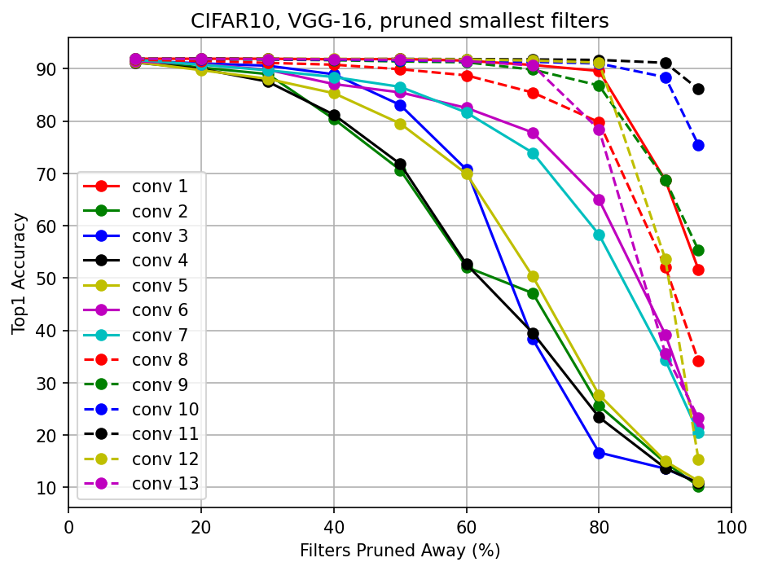

# 03_Pruning_Filters_for_Efficient_Convnets

* `cifar.torch/` 
  * VGG-16 on CIFAR-10 implemented by Zagoruyko(2015)
---
* `vgg16_baseline_exp1/`
  * `cifar.torch/`를 참고하여 vgg16 baseline model을 개발.
    * cifar.torch Top-1 accuracy : 92.45%
    * my model Top-1 accuracy : 91.86%
 ---
* `vgg16_prune_and_retrain/` 
  * `vgg16_baseline_exp1/`에서 구한 baseline model을 이용하여 `Figure2/` visualization을 하기 위한 code 개발.
--- 
* `Figure2/`
  * [(a) : Filters are raneked by $s_j$](https://github.com/LeeHyungSeop/EAI_Basic_PyTorch/blob/main/03_Pruning_Filters_for_Efficient_Convnets/Figure2/a.png)
    
  
  * [(b) : Prune the smallest filters](https://github.com/LeeHyungSeop/EAI_Basic_PyTorch/blob/main/03_Pruning_Filters_for_Efficient_Convnets/Figure2/b/top1_acc.png)
    
  
  * [(c) : Pruned and retrain](https://github.com/LeeHyungSeop/EAI_Basic_PyTorch/blob/main/03_Pruning_Filters_for_Efficient_Convnets/Figure2/c/top1_acc_epoch20.png)
    
---
* `vgg16_prune_A/`
* `vgg16_prune_A_scratch/` 
  * Table 1의 VGG-16 Model 결과를 확인하기 위한 code 개발.
  
    * VGG-16 : vgg16_baseline_exp1/ 에서 개발.
    * VGG-16-pruned-A : vgg16_prune_A/ 에서 개발.
    * VGG-16-pruned scratch-train : vgg16_prune_A_scratch/ 에서 개발